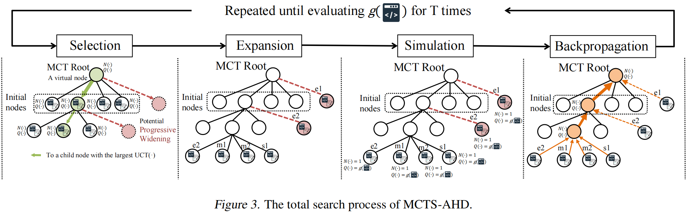
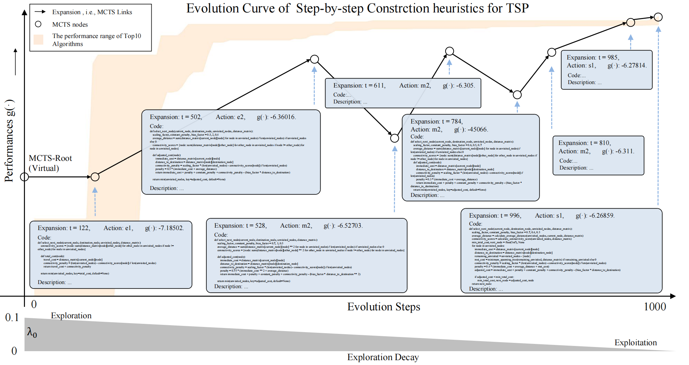

## [ICML2025] Implementation of Paper: Monte Carlo Tree Search for Comprehensive Exploration in LLM-Based Automatic Heuristic Design [Arxiv preprint](https://arxiv.org/pdf/2501.08603)

#### May 23th Update

We implement the Mountain_car optimization task with heuristics. See ./problem for details (please install the gym package to run this experiment).

### MCTS-AHD

MCTS-AHD employs a Monte Carlo Tree Search (MCTS) for LLM-based heuristic evolution while preserving all LLM-generated heuristics in a tree structure. MCTS helps to comprehensively explore the space of heuristic functions and maintain the focus on better-performing ones. Moreover, as a structured data structure, the MCTS tree records the evolution history of heuristics, thus providing organized samples for heuristic evolution and LLMs' reasoning.

To visually demonstrate the workflow of MCTS-AHD and its ability to escape from local optima and conduct a comprehensive exploration, we provide two examples of heuristic function evolution in two tasks, as shown in Figure G. For example, in designing heuristics with a step-by-step construction framework for TSP, MCTS-AHD can expand potential child nodes from nodes (e.g., MCTS node with ``Expansion: t=611``) that are not among the top 10 optimal ones (the performance range of the top 10 optimal heuristics is the yellow shade), and ultimately reach the best heuristic.

### Available tasks (Totally 15 scenarios provided):
NP-hard CO Problems as Tasks
* Step-by-step construction framework:
  * Travelling Salesman Problem (TSP)
  * TSP-copy for a reference on simultaneous heuristic function evaluations
  * 0-1 Knapsack (KP)
  * Online Bin Packing Problem (Online BPP) **(Please set max_fe = 2000 for re-implementing the report results for Online BPP)**
  * Admissible Set Problem (ASP)
* Ant Colony Optimization (ACO) **(Please set init_pop_size = 10 in re-implementing the report results for Black-box settings)**:
  * TSP and Black-box settings
  * Capacitated Vehicle Routing Problem (CVRP) and Black-box settings
  * Multiple Knapsack Problem (MKP) and Black-box settings
  * Offline Bin Packing Problem (Offline BPP) and Black-box settings
* Guided Local Search:
  * (Large-scale) TSP
  
Other Complex Tasks
* Bayesian Optimization (BO):
  * Cost-aware Function Design in Active Learning **(Please set botorch according to the requirements.txt for the report results)**

MCTS-AHD does not need a high-performance seed function (The seed function texts in /prompts records the seed functions used for the report results of Funsearch, ReEvo, and HSEvo in our paper). By Implementing eval.py and evaluation prompts in cfgs, MCTS-AHD can be applied to more scenarios with effectiveness easily.

### Run
Change parameter $\lambda_0$ in <a href="source/mcts.py">source/mcts.py</a>

set cfg/config.yaml and run main.py for heuristic evaluations.

**If you want to run several evaluations simultaneously, please create multiple environments, including copied problems and prompts, and a copied cfg file in cfg/problems with changing the problem name** (See tsp_constructive_copy for reference)

### Report Runs

We also provide all the reported runs of MCTS-AHD in the paper in outputs/. The runs under the step-by-step construction framework are in [Google Drive](https://drive.google.com/file/d/1mWBiWwi4u9FBMXVxOTfZVuvdMSrX50af/view?usp=sharing) and MCTS-AHD runs under the ACO framework is in [Google Drive](https://drive.google.com/file/d/1UhiSlNP6crQvtZfeNEXGFWTI0B1e2yq-/view?usp=sharing).

Moreover, the ``gpt.py`` for each problem in this repository contains a leading heuristic function designed by MCTS-AHD.

### Acknowledge

Thanks to the implementations of [EoH](https://github.com/FeiLiu36/EoH) and [ReEvo](https://github.com/ai4co/reevo). Thanks to co-authors and Professor Wee Sun Lee for suggestions.

### Help

Please contact Zhi Zheng at [zhi.zheng@u.nus.edu](zhi.zheng@u.nus.edu) for issues.
